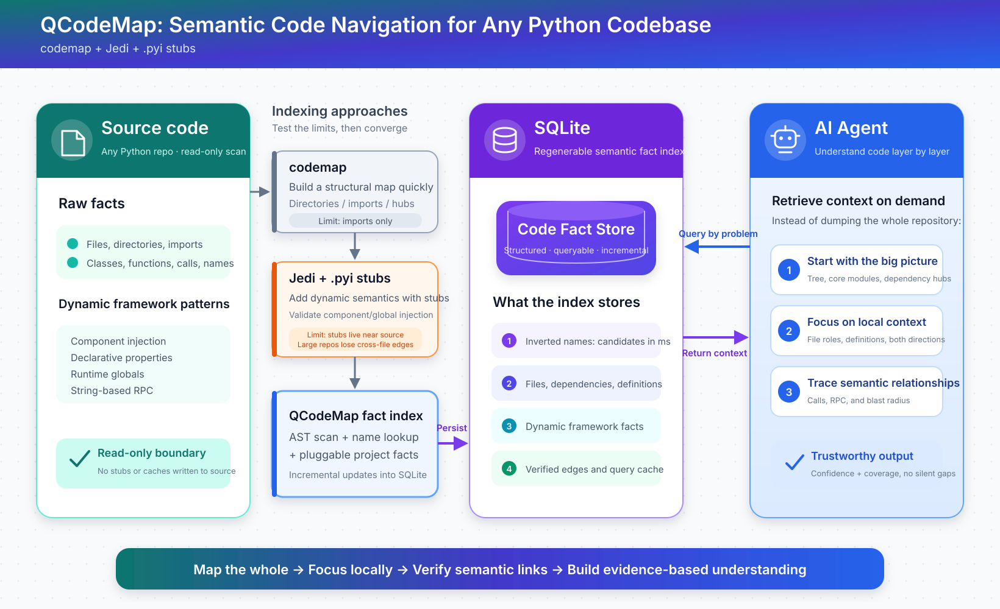

<p align="right">
  <strong>English</strong> | <a href="README.zh-CN.md">简体中文</a>
</p>

# 🗺️ QCodeMap

[](LICENSE) [](https://www.python.org/downloads/) []() []() []()

A **semantic navigation index** for Python codebases, especially large projects
with heavy framework usage. QCodeMap scans definitions, calls, and dynamic
framework patterns—component injection, declarative properties, and runtime
global objects—into a SQLite index. An inverted index and two-stage resolver
then answer questions such as “who calls this?”, “what does this call?”, and
“what will this change affect?” in seconds, with traceable results and no
changes to your source tree.

QCodeMap does not try to understand your application, infer its architecture,
or decide what is relevant. Those jobs belong to engineers and LLMs. It does
one thing:

> Make every “who calls it / what does it call / what will this affect?” query
> fast enough to run casually and reliable enough to trust.

[Quick Start](#-quick-start) • [How It Works](#how-it-works) • [Commands](#commands) • [MCP Server](#-mcp-server) • [Benchmarks](#-benchmarks) • [Comparison](#comparison-with-alternatives)



## The problem

Navigating a large codebase is an iterative loop: ask a question, search, read
code, discover another question, and search again. The expensive part is often
not reasoning—it is the repeated lookup at every step.

Without a purpose-built tool, the usual options all have limits:

- **grep** understands strings, not semantics. Duplicate method names and
  mirrored directories create noise, and it cannot answer “what will changing
  this function affect?”
- **codemap CLI** stops at import-level dependency analysis and has no call
  graph. Repository-wide `--deps` can hit ast-grep's 30-second timeout on a
  ten-thousand-file project.
- **jedi with type stubs** silently drops cross-file call edges once a large
  repository exceeds its 30-file analysis limit. Queries take 12–17 seconds,
  and `.pyi` stubs must live beside the source instead of being managed
  separately.

The deeper problem is dynamic framework behavior. Large Python applications
often copy components with `setattr` rather than inheritance, inject globals at
runtime, or register properties declaratively. General-purpose tools cannot see
these patterns. Type stubs help with some of them, but their required placement
ties framework knowledge to the source tree.

## Core idea

Code navigation does not need a more imaginative tool. It needs queries with
lower cost and more dependable evidence.

QCodeMap replaces repeated repository scans with lookups against a prebuilt
index. Framework knowledge that would otherwise live in source-adjacent stubs
becomes reproducible fact rows in that index. The investigation process stays
the same, but each lookup becomes an order of magnitude faster.

The bottleneck is lookup cost and result confidence—not analysis ambition.

## What it is—and what it is not

### ✅ It is

- A static indexer that stores a codebase, including dynamic framework facts,
  in SQLite
- A fast way to query call chains, pair RPC/event endpoints, and calculate
  change impact
- A navigation layer for engineers and LLMs that points directly to files and
  line ranges
- A confidence-aware result set (`VERIFIED`, `FRAMEWORK-INFERRED`, and
  `CANDIDATE`) that prefers omissions over false edges

### ❌ It is not

- A general semantic analyzer or architecture inference engine
- An IDE with completion and refactoring support
- Runtime instrumentation; QCodeMap is static and never executes your code
- A replacement for human or LLM judgment about which code matters

## Results in practice

### With grep

```text
grep "GetTeammateInfo"
→ Many hits: duplicate methods, mirrored directories, and comments
→ Every file must be checked manually
→ Component injection and runtime-injected objects remain invisible
```

### With QCodeMap

```text
qcodemap callers src/logic/avatar.py GetTeammateInfo
→ Sub-second response with VERIFIED/CANDIDATE on every edge and definition lines
→ custom/ hooks explain component, RPC, event, and other framework conventions
→ Expand only when needed: edge → snippet → full file
```

The reasoning process and final conclusion stay the same. Lookups drop from
minutes to sub-second time, and every result remains traceable to source.

## 📊 Benchmarks

Pilot repository: approximately 9,000 game client/server files (2026-08-20,
v0.10).

| Metric | Result |
| --- | --- |
| Full index build | 8,950 files / 97.5s / 220MB (down from 449MB) |
| Semantic query with verification | Sub-second; first query for a very common name around 3s |
| Edge-cache hit | 0.001s |
| Five-file incremental update | Under 1s |
| Semantic regression | 5/5 expected edges, zero false edges |
| Four structural commands | 0.22–0.24s each across the full repository |
| `blast-radius` | 2 files / 121 functions: 43.2s cold, 0.7s warm after a resolver upgrade |
| Agent queries | `find` 0.004s / `file-context` 0.16s / `context` 0.34s |
| Full freshness scan | 0.61s; CLI/MCP incrementally refresh added, modified, and deleted files |

## ⚡ Quick Start

QCodeMap uses only the Python standard library (`ast`, `sqlite3`, `re`, and
friends). Clone it and run it—there are no third-party dependencies. Generated
indexes live in `cache/`, can be rebuilt at any time, and never write into the
repository being analyzed.

AI agents can start with the bundled
[QCodeMap Agent skill](skill/qcodemap-agent/SKILL.md) to learn the repository,
select the right query, and adapt `custom/` without mixing project rules into
the core.

```bash
cd QCodeMap

# Build an index. Define a project profile in custom/ first (see custom/README.md),
# or point the CLI directly at any Python repository.
# --targets indexes only these top-level directories under the root, such as
# src,lib. Omit it to scan the entire root.
python -m qcodemap build --root /path/to/your/project --targets src,lib
# --targets refreshes and prunes only the selected scope.
# Use --rebuild --targets when intentionally creating a subset index.

# Find callers of a function.
# VERIFIED = semantically verified edge; CANDIDATE = unresolved same-name match.
python -m qcodemap callers src/logic/avatar.py GetTeammateInfo
```

## Commands

### Call graph with semantic verification

```bash
python -m qcodemap callers src/logic/avatar.py GetTeammateInfo  # Who calls it?
python -m qcodemap callers src/logic/avatar.py Activate --receiver-class FestivalTargetEntity
python -m qcodemap callees src/logic/avatar.py RefreshToplogo   # What does it call?
python -m qcodemap usages HasSkywing                            # Identifier occurrences
python -m qcodemap defs HasSkywing                              # Definitions
python -m qcodemap diagnose                                     # Project diagnostics from custom hooks
```

### RPC and event endpoint pairing

```bash
# Pair string-dispatched RPC calls with handlers, including channel and stub.
python -m qcodemap rpc-refs SetPlayerAimState
python -m qcodemap rpc-refs ObtainClan --stub ClanStub

# Pair event publishers with handlers; imported constants are normalized.
python -m qcodemap pubsub-refs ON_MONEY_DMZ_COIN_CHANGE
```

### Structural analysis

```bash
python -m qcodemap deps <file-or-directory>
python -m qcodemap importers <file>
python -m qcodemap hubs --top 25
python -m qcodemap tree --depth 2
```

### Change impact: call closure and imports

```bash
python -m qcodemap blast-radius                        # Collect changes from svn status
python -m qcodemap blast-radius --rev 100:200          # Revision range
python -m qcodemap blast-radius --files a.py,b.py      # Explicit file list
python -m qcodemap blast-radius --mode summary         # Counts and layer summary only
python -m qcodemap blast-radius --mode page --section callers --layer 2 --offset 0 --limit 50
```

### AI agent-oriented queries

```bash
python -m qcodemap find avatar_scene                 # Fuzzy path search
python -m qcodemap file-context src/logic/avatar.py  # Package one file's facts
python -m qcodemap context --compact                 # Compact project profile for a new session
```

Every query command supports the same `--root`, `--db`, `--json`, and
`--refresh auto|check|off` options. JSON responses include `schema_version`,
`coverage`, and `index` metadata: build time, refresh status, drift count,
configuration fingerprint, and `index.scope`. Files that fail AST parsing are
reported as partial coverage instead of disappearing silently.

The CLI returns full `blast-radius` output by default for compatibility; MCP
defaults to `summary`. Request details with
`mode=page, section, layer, offset, limit` to avoid flooding an agent context.

## How it works

- QCodeMap scans the repository and stores definitions, calls, component edges,
  RPC facts, and event registrations in SQLite with an inverted index.
- Framework-specific conventions—`setattr` component injection, runtime global
  injection, and declarative properties—are translated by `custom/facts.py`
  hooks into rows the generic core can consume. **Stub knowledge becomes index
  data.**
- Module-level registries or generated tables can emit generic `binding` facts;
  `custom` owns their field and fallback semantics, while the core only stores
  and joins opaque relations.
- Queries first retrieve name candidates, then verify them with MRO, component
  edges, data flow, and return-type evidence.
- Index files remain separate from source and can always be rebuilt. CLI and MCP
  queries scan the repository file set and mtimes by default, then refresh only
  files that were added, modified, or deleted.
- Query connections are SQLite read-only snapshots; WAL and a single-writer
  build lock allow reads to continue during incremental refreshes.
- The core knows nothing about a particular project. Framework conventions and
  indexing scope live entirely under `custom/`; the public repository includes
  only a template in `custom/README.md`.

There is no runtime, injection, or application-code execution. Every result is
traceable evidence rather than a guess.

## Confidence levels

- `VERIFIED`: semantic evidence—MRO, component edges, data flow, or return
  values—resolved the call to the target definition.
- `FRAMEWORK-INFERRED`: a custom hook supplied reliable receiver-type evidence
  and narrowed otherwise ambiguous same-name candidates.
- `CANDIDATE`: the call shape matches, but resolution is unreachable or
  ambiguous; the result reports which same-name definition was considered.
- `RPC-INFERRED`, `EVENT-INFERRED`, and `PROPERTY-INFERRED`: a custom framework
  convention supports the edge. The result retains channel or shared-host
  evidence without pretending to be semantically verified.
- If QCodeMap cannot resolve an edge, it downgrades confidence instead of
  inventing a false one.

## 🔌 MCP Server

```bash
python -m qcodemap mcp   # stdio server with 17 tools; works with any MCP client
```

Once registered, an AI agent can use callers/callees for call chains,
`blast-radius` for impact analysis, `file-context` for a complete single-file
view, and `context` for a compact project profile—without repeatedly grepping
and opening whole files.

## Good fit

- Python repositories with around ten thousand files, where context and manual
  navigation are both expensive
- Framework-heavy projects with component injection, service locators, and
  declarative registration
- AI agents that need trustworthy, pageable code facts over MCP
- Impact analysis before refactoring or merging changes

## Not a good fit

- Small projects that are easy to read in full
- Non-Python repositories
- Questions about actual runtime behavior
- Workflows requiring full IDE completion or automated refactoring

## Comparison with alternatives

| Capability | QCodeMap | codemap CLI | jedi + `.pyi` stubs | grep |
| --- | --- | --- | --- | --- |
| Call graph (callers/callees) | ✅ Semantic verification | ❌ Import level only | ⚠️ Silently loses cross-file edges in large repositories | ❌ String matches |
| Dynamic framework patterns | ✅ Pluggable custom hooks | ❌ | ⚠️ Stubs must live beside source | ❌ |
| Physically separate from source | ✅ | ✅ | ❌ | — |
| Full structure query over ~10k files | ✅ 0.22s | ⚠️ 30s timeout | — | ✅ |
| Explicit confidence levels | ✅ VERIFIED/CANDIDATE | — | ❌ Silent omissions | ❌ Noisy |
| Dependencies | Python stdlib only | ast-grep binary | jedi | None |

## Design principles

> State facts without pretending to understand. Downgrade when resolution is
> incomplete; never invent an edge.

Deterministic, traceable, and reproducible. QCodeMap is a query engine, not a
framework.

## Repository layout

```text
qcodemap/     Project-agnostic core: cli / build / scanner / store / resolve /
              structure / blast / context / rpc_refs / pubsub_refs / ui_refs /
              freshness / fingerprint / mcp_server / hooks / config / defaults
custom/       Project layer: config.py (scope) / facts.py (framework hooks) /
              seeds.py (manual facts) / ui_profile.py + tbui_index.py
              (ui-refs vocabulary and resource format). The repository ships
              README.md only.
skill/        Bundled qcodemap-agent onboarding skill for repository navigation
              and sanitized custom integration guidance.
tests/        Self-contained regressions (test_p4/test_p5 create temporary
              repositories). Pilot-project regressions and custom profiles stay
              in the local workspace and are not published.
cache/        Rebuildable index artifacts (about 220MB in the pilot; not tracked)
docs/         In-depth documentation
```

## Documentation

| Document | Contents |
| --- | --- |
| [skill/qcodemap-agent/SKILL.md](skill/qcodemap-agent/SKILL.md) | Fast agent onboarding, query routing, and privacy-safe custom adaptation |
| [docs/ARCHITECTURE.md](docs/ARCHITECTURE.md) | Module responsibilities, data flow, schema, and key design decisions |
| [docs/CUSTOM_GUIDE.md](docs/CUSTOM_GUIDE.md) | Step-by-step guide to adapting a project, extending semantics, and adding commands |

## Maintenance

- Run the public self-contained regressions after every change:
  `python tests/test_p4.py` and `python tests/test_p5.py`. When the pilot
  repository and its local project profile are available, run the full local
  regression suite as well.
- Increment `RESOLVER_VERSION` at the top of `resolve.py` whenever resolver
  behavior changes; old edge caches then invalidate automatically. Increment
  `SCHEMA_VERSION` at the top of `store.py` and rebuild after schema changes.
- Put every new framework convention in `custom/facts.py`; the core package must
  not know framework-specific names.

## License

MIT License — see [LICENSE](LICENSE).

## Acknowledgements

- The four structural commands were benchmarked against codemap CLI v4.4.0 and
  avoid its timeout on ten-thousand-file repositories.
- An earlier jedi-stub proof of concept provided initial benchmarks and has been
  superseded by this implementation.

> QCodeMap makes code navigation fast and dependable.
