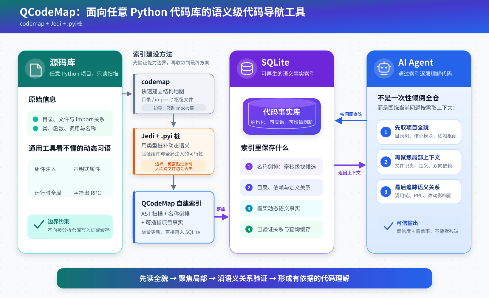

# QCodeMap

面向任意 Python 代码库的**语义级代码导航工具**：把框架动态语义（组件注入、
声明式属性、运行时全局注入等习语）数据化为 SQLite 事实表，配倒排索引与
两阶段查询，提供秒级、可信、与源码物理分离的调用链查询。

- 纯标准库（ast / sqlite3 / re / importlib / json），零第三方依赖
- 索引产物在 `cache/`，可再生，被分析项目零写入（svn/git 无感知）
- 核心引擎项目无关；项目习语与索引范围全部放在 `custom/` 定制层（仓库仅含
  模板说明，见 custom/README.md）
- 孵化案例：约 9000 文件的游戏客户端/服务端代码库，全量建库 207s、库 441MB、
  语义查询亚秒

## 解决什么问题

| 传统手段 | 实测硬伤 |
| --- | --- |
| grep | 只认字符串不认语义；同名函数/镜像目录噪音大；答不了「改这个函数影响谁」 |
| codemap CLI | 依赖分析仅 import 级，无调用链；全仓 --deps 触发 ast-grep 30s 超时 |
| jedi + .pyi 桩 | 大库跨文件边静默丢失（30 文件解析安全阀）；单查询 12~17s；.pyi 无法与源码分离 |

根因：许多项目框架存在动态语义——组件注入是 setattr 拷贝（不进 MRO）、全局
对象是运行时注入、属性是声明式注册。通用工具天生看不懂；jedi 配 .pyi 桩能
部分解决，但桩必须与源码同目录，无法与源码分离。QCodeMap 把这些「桩知识」
降格为索引库里的数据行，习语规则经 `custom/` 钩子插拔，换项目零改核心。

## 框架图



## 快速上手

```bash
cd QCodeMap

# 建索引：首次在 custom/ 写项目档案（见 custom/README.md），
# 或直接用参数对任意 Python 目录开扫（万文件级全量约 3.5 分钟；日常增量亚秒）
# --targets：只索引项目根下这些顶层目录（逗号分隔，如 src,lib = src/ + lib/），
# 用于跳过 tests/docs/产物等无关目录；不传则 ROOT 全量扫描
python -m qcodemap build --root /path/to/your/project --targets src,lib

# 谁调用这个函数（VERIFIED=语义验证边 / CANDIDATE=同名候选）
python -m qcodemap callers src/logic/avatar.py GetTeammateInfo

# 这个函数调了谁
python -m qcodemap callees src/logic/avatar.py RefreshToplogo

# 标识符全仓出现点
python -m qcodemap usages HasSkywing

# RPC 双端跳转（字符串分发形态，通道与 stub 一并列出）
python -m qcodemap rpc-refs SetPlayerAimState
python -m qcodemap rpc-refs ObtainClan --stub ClanStub

# 事件双端配对（订阅 handler ↔ 发布点，事件键 import 归一）
python -m qcodemap pubsub-refs ON_MONEY_DMZ_COIN_CHANGE

# 结构四件套（codemap 平价，无超时）
python -m qcodemap deps <文件或目录>
python -m qcodemap importers <文件>
python -m qcodemap hubs --top 25
python -m qcodemap tree --depth 2

# 变更影响面：调用链闭包 + import 级双维度
python -m qcodemap blast-radius                        # 默认 svn st 采集变更
python -m qcodemap blast-radius --rev 100:200          # 版本区间
python -m qcodemap blast-radius --files a.py,b.py      # 显式清单
python -m qcodemap blast-radius --mode summary         # 仅计数与层摘要
python -m qcodemap blast-radius --mode page --section callers --layer 2 --offset 0 --limit 50

# agent 消费面（P4）：路径定位 / 单文件打包 / 项目档案
python -m qcodemap find avatar_scene                   # 模糊路径搜索
python -m qcodemap file-context src/logic/avatar.py
python -m qcodemap context --compact                   # AI 会话冷启动注入

# MCP server（stdio，14 个工具；可注册进任意 MCP 客户端）
python -m qcodemap mcp
```

所有命令支持 `--json` 机器可读输出（带 `schema_version` 与 `coverage`；
ast 解析失败文件会在 coverage 里以 partial 状态透出，不静默残缺）。
`blast-radius` 的 CLI 默认 `full` 保持兼容；MCP 默认 `summary` 防止大影响面
撑满上下文，可用 `mode=page, section, layer, offset, limit` 按需取明细。

## 实测指标（孵化案例：约 9000 文件游戏项目，2026-08-18）

| 指标 | 数值 |
| --- | --- |
| 全量建库 | 8927 文件 / 469s / 447MB（对照 PyCharm 同库索引 3.8GB） |
| 语义查询（含验证） | 亚秒级；高频名首查 3s 量级 |
| edges 缓存命中 | 0.001s |
| 单文件增量 | 0.5s |
| 语义回归 | 5/5 标准答案边，零假边 |
| 结构四命令 | 全库各 0.22~0.24s |
| blast-radius | 2 文件 121 函数冷 43.2s / 热 0.7s（解析器升级后首次冷缓存） |
| agent 消费面三命令 | find 0.004s / file-context 0.16s / context 0.34s（见 REQUIREMENTS 附录 E） |
| 懒刷新 | MCP 查询发现 mtime 漂移自动增量 build，单文件级秒内 |

## 输出分级（零误报优先）

- `VERIFIED`：语义验证链路（MRO/组件边/数据流/返回事实）落到目标定义
- `CANDIDATE`：调用形态成立但解析不可达或同名歧义，注明解析到了哪个同名定义
- `RPC-INFERRED` / `EVENT-INFERRED` / `PROPERTY-INFERRED`：由 custom
  声明的框架约定推断，保留通道或共同运行时宿主证据，不冒充语义验证
- 解析不了宁可降级，不给假边

## 目录结构

```
qcodemap/     核心引擎（项目无关）：cli / build / scanner / store / resolve /
              structure / blast / context / rpc_refs / pubsub_refs /
              mcp_server / hooks / config / defaults
custom/       项目定制层：config.py（范围）/ facts.py（框架习语钩子）/
              seeds.py（人工种子）。仓库仅随附 README.md 模板
tests/        十件回归套件 + original/（可行性脚本存档）；局部 import、
              callback、P4、RPC、pubsub 使用自建临时库，其余锚定孵化案例项目
              （需该代码库在场）
cache/        索引产物（441MB，可再生，不入库）
docs/         深入文档（见下）
```

## 文档索引

| 文档 | 内容 |
| --- | --- |
| [REQUIREMENTS.md](REQUIREMENTS.md) | 需求与验收标准、实测数据附录（含孵化案例全链路数据） |
| [docs/ARCHITECTURE.md](docs/ARCHITECTURE.md) | 模块职责、数据流、表结构、关键设计决策与原因 |
| [docs/CUSTOM_GUIDE.md](docs/CUSTOM_GUIDE.md) | 二次开发指南：换项目/扩语义/加命令的手把手路径 |

## 维护约定

- 改动后必跑回归：`python tests/test_feasibility.py`（5/5）与
  `python tests/test_scale.py`，动解析器则六个全跑（含 test_p4.py）
- 解析器行为变更必须 `RESOLVER_VERSION + 1`（resolve.py 顶部），旧缓存自动失效；
  存储结构变更必须 `SCHEMA_VERSION + 1`（store.py 顶部）并 `--rebuild`
- 新框架语义一律写进 `custom/facts.py` 钩子，核心包不认识任何框架名
